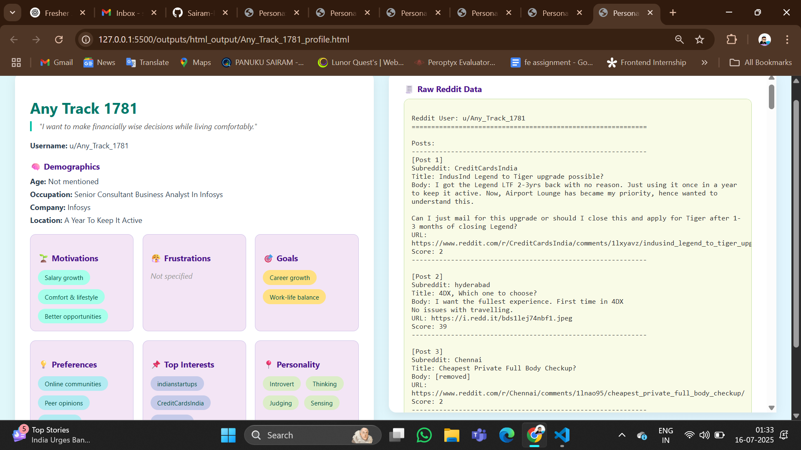

# 🧠 Reddit User Persona Extractor

**Reddit User Persona Extractor** is a Python-based tool that automates the extraction and visualization of **user personas** using public **Reddit posts and comments**.

It analyzes user behavior, builds a structured profile, and generates a clean, scrollable **HTML page** containing both:
- ✨ The extracted persona (age, job, motivations, etc.)
- 📄 Raw scraped Reddit data

---

## 📌 Features

- 🔍 Fetches Reddit posts & comments from given usernames  
- 🤖 Automatically extracts key behavioral persona attributes  
- 📄 Outputs:
  - `.txt` – raw Reddit content
  - `.json` – structured persona data
  - `.html` – styled user profile page
- 🎨 Beautiful, responsive HTML layout (side-by-side view)
- 🧾 Scrollable right panel showing raw content

---

## 🛠️ Tech Stack

- `Python 3.7+`
- [`PRAW`](https://praw.readthedocs.io/) – Reddit API wrapper
- `HTML + CSS` – responsive & aesthetic layout
- `python-dotenv` – secure `.env` loading
- *(Optional)* GPT-based persona generation

---
## 📁 Folder Structure

```
reddit-user-persona/
├── .env                      # Reddit credentials (ignored)
├── .gitignore
├── main.py                   # Orchestrates full flow
├── generate_persona.py       # Extracts persona from text
├── generate_html_profile.py  # Creates styled HTML profiles
├── sample_output.png         # Screenshot of final HTML output
├── requirements.txt
├── README.md
└── outputs/
    ├── text_output/          # Raw Reddit content (.txt)
    ├── json_output/          # Persona data (.json)
    └── html_output/          # Final profile pages (.html)

```
## 🚀 Getting Started

### 1. Clone the Repo

```
git clone https://github.com/Sairam-Panuku/reddit-user-persona.git
cd reddit-user-persona
````

### 2. Install Dependencies

```
pip install -r requirements.txt
```

✅ Ensure `praw` and `python-dotenv` are included in `requirements.txt`.

### 3. Setup Reddit API

Create a `.env` file with your credentials:

```
REDDIT_CLIENT_ID=your_client_id
REDDIT_CLIENT_SECRET=your_client_secret
REDDIT_USERNAME=your_reddit_username
REDDIT_PASSWORD=your_reddit_password
REDDIT_USER_AGENT=persona-extractor-script
```

### 4. Run the Script

```
python main.py
```

Generated outputs will be saved under the `outputs/` directory:

* 🔹 `text_output/` – raw data (`username.txt`)
* 🔹 `json_output/` – persona info (`username_persona.json`)
* 🔹 `html_output/` – full profile (`username_profile.html`)

---

## 📸 Sample Output

Here’s how the final persona profile looks in HTML:



> 💡 Left: Persona profile
> 📄 Right: Scrollable raw Reddit data

---

## 🧠 Use Cases

* UX Designers building behavior-driven personas
* Recruiters reviewing public user footprints
* Social scientists analyzing discussion patterns
* Developers building user intelligence dashboards

---

## 📝 Notes

* Each user undergoes:

  1. Post/comment scraping
  2. Persona extraction from `.txt`
  3. HTML profile generation
* The layout is responsive and clean
* The `.env` file is ignored by `.gitignore` for safety

---

## 🤝 Contributing

Contributions are welcome! You can suggest or build:

* 🌙 Dark mode UI
* 📈 Persona comparison features
* 🧠 GPT-powered richer persona modeling
* 🖨️ Export to PDF

---

## 📄 License

MIT License – free to use, fork, and modify. Attribution appreciated 💙

---

## 💡 Inspiration

Built to help designers, developers, and researchers **visualize user behavior** through structured Reddit profiles and social footprints.

---

> Built with ❤️ by [Sairam Panuku](https://github.com/Sairam-Panuku)


